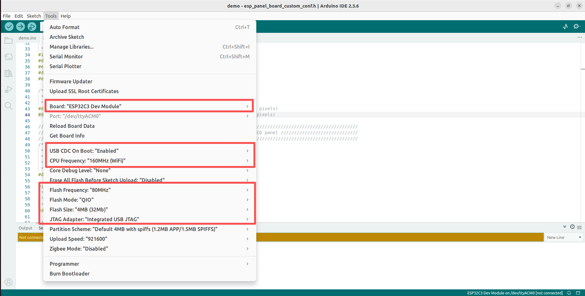

## ESP32-2432S012

[中文](README.md)

### Select Different TP (Touch Panel)
Modify `demo/esp_panel_board_custom_conf.h`

Capacitive Touch:

    #defineESP32_2424S012C     (1)
    #defineESP32_2424S012N     (0)

No Touch:

    #defineESP32_2424S012C     (0)
    #defineESP32_2424S012N     (1)

### Abnormal Screen Display Colors
Change `#define LV_COLOR_16_SWAP 0` to `#define LV_COLOR_16_SWAP 1` in the `libraries/lv_conf.h` file.

### Board Settings
