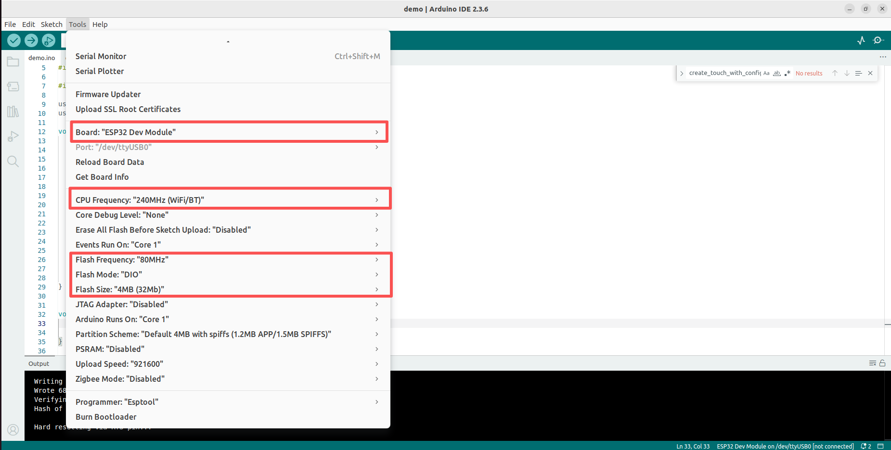

## ESP32-2432S032

[English](README_en.md)

### 选择不同的tp
修改`demo/esp_panel_board_custom_conf.h`

电容触摸：

    #define ESP32_2432S032C     (1)
    #define ESP32_2432S032R     (0)
    #define ESP32_2432S032N     (0)

电阻触摸：

    #define ESP32_2432S032C     (0)
    #define ESP32_2432S032R     (1)
    #define ESP32_2432S032N     (0)

无触摸：

    #define ESP32_2432S032C     (0)
    #define ESP32_2432S032R     (0)
    #define ESP32_2432S032N     (1)

### 屏幕显示颜色异常
将`libraries/lv_conf.h`文件中`#define LV_COLOR_16_SWAP 0`修改为`#define LV_COLOR_16_SWAP 1`

### Board settings
