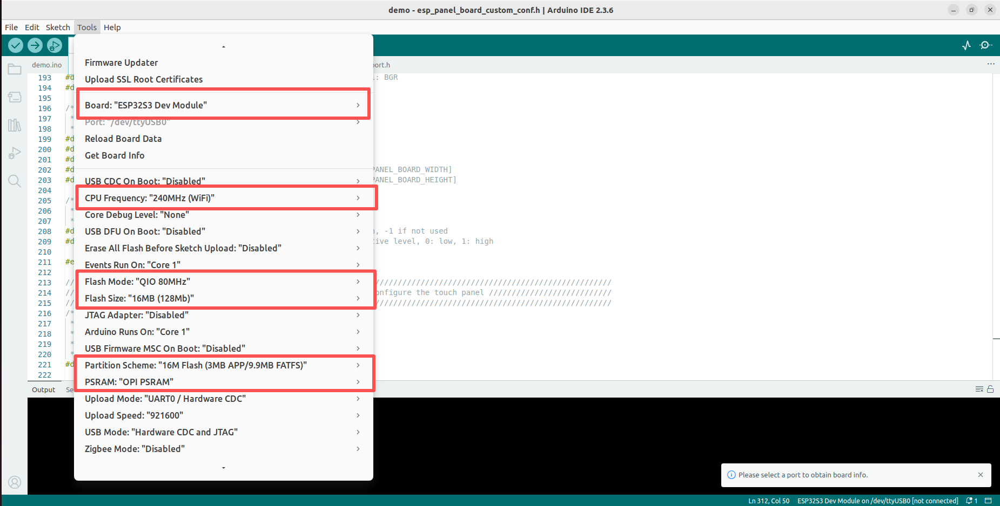

## JC8048S070C

[English](README_en.md)

### JC8048S070N
本工程默认使用的是电容触摸，如果型号为JC8048S070N，请将`demo/esp_panel_board_custom_conf.h`中的`#define ESP_PANEL_BOARD_USE_TOUCH               (1)`修改为`#define ESP_PANEL_BOARD_USE_TOUCH               (0)`

### Board setting
