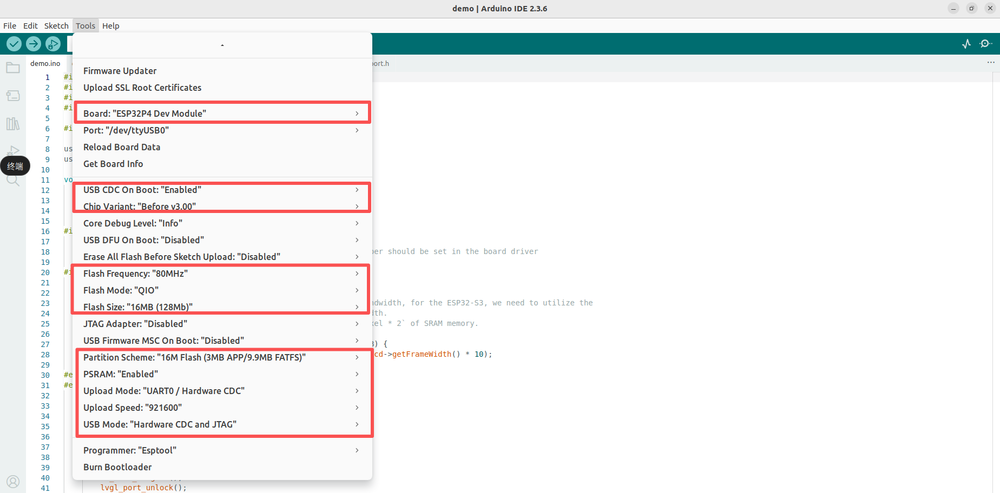

## JC1060P470C-I

[English](README_en.md)

### JC8012P4A1编译事项
ESP32_Display_Panel库文件当前没有添加gsl3680的驱动，需要手动添加

将touch文件下内容复制到libraries/ESP32_Display_Panel/src/touch/文件夹下

注：libraries路径可在在 File ->  Preferences -> Sketchbook location下找到

### Board setting
