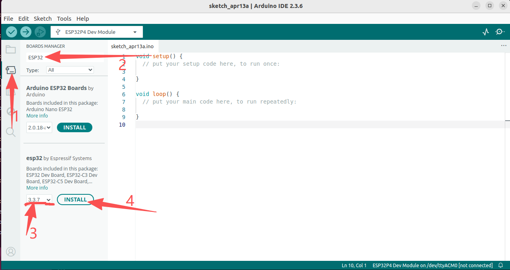
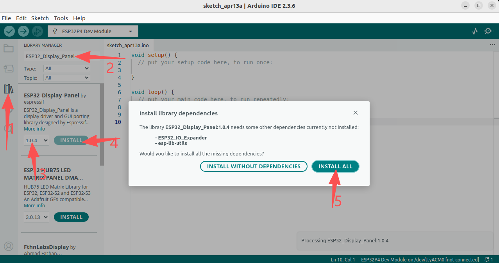
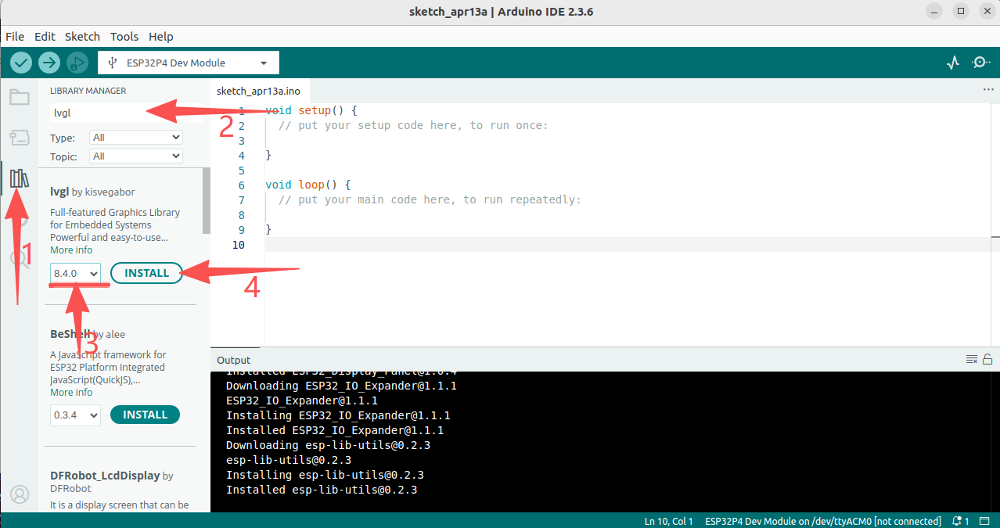

## 安装库文件
    1. 进入开发板管理器，下载ESP32开发板

    2. 进入库文件管理器，下载相关文件
        - ESP32_Display_Panel
        - ESP32_IO_Expander
        - esp-lib-utils

    3. 进入库文件管理器，下载相关文件
        - lvgl

## 配置lvgl
    1. 将lv_conf.h文件复制到Arduino/libraries/目录下
    2. 将Arduino/libraries/lvgl/demos文件夹复制到Arduino/libraries/lvgl/src目录下
    - 注： 上方路径是在Linux系统下的路径，其他系统请自行修改，打开 File  -> Preferences ，即可看到Sketchbook location：，下方就是libraries的路径。

## 配置Board
    请根据型号文件夹内的图片进行配置

## 屏幕漂移
RGB屏幕有可能会出现屏幕漂移，解决方式请查看[ESP32_Display_Panel中的常见问题以及解答](https://github.com/esp-arduino-libs/ESP32_Display_Panel/blob/master/docs/envs/use_with_arduino_cn.md#%E5%B8%B8%E8%A7%81%E9%97%AE%E9%A2%98%E5%8F%8A%E8%A7%A3%E7%AD%94)